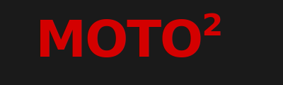

<div align="center">
  
  
  # Moto² — Portland Motorcycle & Moped Community
  
  > **Right to Repair**: Peer-to-peer platform for Portland's moped and motorcycle community
  
  <a href="#-overview">Overview</a> •
  <a href="#-design-system">Design</a> •
  <a href="#-quick-start">Quick Start</a> •
  <a href="#-features">Features</a> •
  <a href="#-branding">Branding</a>
</div>

---

## 🏍️ Overview

Moto² is a community-driven platform connecting Portland riders, mechanics, and enthusiasts. Share tools, find workspace, exchange knowledge, and build your local repair network.

## 🎨 Design System

**Moto² Design Philosophy**: Performance meets accessibility. Bold confidence with warm approachability.

### Color Palette

- **Moto Red (#D40000)** — Action, urgency, identity (40% usage)
- **Matte Black (#1A1A1A)** — Structure, sophistication (30% usage)  
- **Cream (#F5F1E8)** — Warmth, community, vintage (20% usage)
- **Silver (#B8B8B8)** — Metallic accents
- **Status Colors**: Success (#4CAF50), Warning (#FFC107), Error (#D40000)

### Typography

- **Display Font**: Bebas Neue, Oswald (headers, emphasis)
- **Body Font**: Inter, Roboto (content, UI)

## 🚀 Quick Start

### Prerequisites

- Node.js 18+ 
- npm or yarn

### Installation

```bash
# Clone the repository
git clone https://github.com/evastar1587/moto2.git
cd moto2

# Install dependencies
npm install

# Start development server
npm run dev
```

Visit `http://localhost:3000` to see the app.

### Build for Production

```bash
npm run build
npm run preview
```

## 📁 Project Structure

```
moto2/
├── src/
│   ├── components/
│   │   ├── common/          # Reusable UI components
│   │   │   ├── ErrorBoundary.jsx
│   │   │   ├── Modal.jsx
│   │   │   └── Skeleton.jsx
│   │   ├── inventory/       # Tool sharing components
│   │   │   ├── ToolCard.jsx
│   │   │   └── ToolRequestModal.jsx
│   │   └── layout/          # Layout components
│   │       └── Header.jsx
│   ├── pages/               # Main application pages
│   │   ├── FeedPage.jsx
│   │   ├── PeoplePage.jsx
│   │   ├── InventoryPage.jsx
│   │   └── GuidesPage.jsx
│   ├── hooks/               # Custom React hooks
│   │   └── useTools.js
│   ├── data/                # Mock data
│   │   └── tools.js
│   ├── utils/               # Utility functions
│   │   └── analytics.js
│   ├── styles/
│   │   └── globals.css
│   ├── config.js            # Environment configuration
│   ├── App.jsx              # Main app component
│   └── main.jsx             # App entry point
├── index.html
├── tailwind.config.js       # Tailwind + Moto² design system
├── vite.config.js
├── package.json
└── .env.example             # Environment variables template
```

## 🔧 Features

### ✅ Implemented

- **Feed**: Community updates and discussions (coming soon)
- **People**: Connect with local riders and mechanics (coming soon)
- **Inventory**: Browse and request tools and workspace
  - Filter by type (tools/spaces), distance, and price
  - Request borrowing with date selection
  - Free and paid options
- **Guides**: Repair guides and tutorials (coming soon)
- **Design System**: Complete Moto² color palette and typography
- **Error Handling**: Global error boundary
- **State Persistence**: Active tab saved to localStorage
- **Responsive Design**: Mobile-first (375px, 768px, 1024px+)
- **Accessibility**: Keyboard navigation, ARIA labels, screen reader support

### 🚧 Coming Soon

- User authentication
- Real-time messaging
- Community feed with posts and comments
- User profiles and ratings
- Interactive repair guides
- Map view for tool locations

## 🎯 Core Pages

### 1. Feed
Community updates, questions, and project shares.

### 2. People
Directory of riders, mechanics, and tool owners in Portland.

### 3. Inventory (Tools)
Share and borrow specialty tools and garage space:
- Torque wrenches, carb sync tools, multimeters
- Garage bays and workshop access
- Filter by distance, type, and availability
- Free and paid options with deposit protection

### 4. Guides
Step-by-step repair and maintenance guides for common tasks.

## 🛠️ Configuration

### Environment Variables

Copy `.env.example` to `.env` and configure:

```bash
# API Configuration
VITE_API_URL=http://localhost:3000/api

# Feature Flags
VITE_ENABLE_AUTH=false
VITE_ENABLE_MESSAGING=false

# External Services
VITE_MOPED_DIVISION_AFFILIATE_ID=
VITE_MAPBOX_TOKEN=
```

## 🧪 Development

### Available Scripts

- `npm run dev` — Start dev server
- `npm run build` — Build for production
- `npm run preview` — Preview production build
- `npm run lint` — Run ESLint

### Adding Components

All components follow the Moto² design system:

```jsx
// Example component with Moto² styling
<div className="bg-moto-charcoal border-l-4 border-moto-red">
  <h2 className="text-moto-red font-bold uppercase">Title</h2>
  <p className="text-zinc-300">Content</p>
</div>
```

### Custom Hooks

Located in `src/hooks/`:
- `useTools.js` — Fetch and manage tool inventory

### Adding Pages

1. Create page component in `src/pages/`
2. Import in `src/App.jsx`
3. Add to tab navigation in `Header.jsx`

## 🤝 Contributing

We welcome contributions! Please:

1. Fork the repository
2. Create a feature branch
3. Follow the Moto² design system
4. Test on mobile and desktop
5. Submit a pull request

### Design Guidelines

- Use Moto² color palette consistently
- Include "RIGHT TO REPAIR" messaging where appropriate
- Maintain mobile-first responsive design
- Ensure keyboard accessibility
- Follow existing component patterns

## 🎨 Branding

### Logo Assets

The MOTO² brand identity is built around a bold, motorsport-inspired design system. All logo assets are available in the `/public/logos` directory.

#### Primary Logo: MOTO²

Available in four approved color variations:

- **Version 1: Ducati Red on Matte Black** (PRIMARY) — `moto2-primary-red-on-black.svg`
  - Use for: App icons, headers, dark mode, stickers
- **Version 2: Matte Black on Cream** (Vintage) — `moto2-primary-black-on-cream.svg`
  - Use for: Documentation, posters, light mode, print
- **Version 3: White on Ducati Red** (Action) — `moto2-primary-white-on-red.svg`
  - Use for: Buttons, badges, high-contrast CTAs
- **Version 4: Monochrome** (Premium) — `moto2-primary-monochrome-*.svg`
  - Use for: Embroidery, laser etching, single-color applications

#### Secondary Logo: M²

Minimal mark for constrained spaces (favicons, app icons, social profiles):

- `m2-minimal-red-on-black.svg` — Primary compact version
- `m2-minimal-black-on-cream.svg` — Vintage compact version
- `m2-minimal-white-on-red.svg` — Action compact version
- `m2-minimal-monochrome-*.svg` — Premium compact versions

#### App Icons

Three style concepts optimized for different platforms:

- **Racing Badge** (`app-icon-racing-badge.svg`) — M² in black on Ducati Red
- **Minimal M²** (`app-icon-minimal.svg`) — M² in red on Matte Black
- **Vintage Number Plate** (`app-icon-vintage.svg`) — M² on Cream with red accent

### Brand Guidelines

For complete brand specifications, color codes, typography pairings, usage guidelines, and do's/don'ts, see:

📖 **[Brand Style Guide](./docs/brand/STYLE_GUIDE.md)**

Key specifications:
- **Font**: Bebas Neue (Bold) with -3% letter spacing
- **Superscript "2"**: 60% of main text, positioned upper-right
- **Primary Colors**: Ducati Red `#D40000`, Matte Black `#1A1A1A`, Cream `#F5F1E8`
- **Display Typography**: Bebas Neue, Oswald, Montserrat
- **Body Typography**: Inter, Roboto, Open Sans

### Credits

- **Design**: MOTO² Brand Identity (2024)
- **Typography**: Bebas Neue by Dharma Type, Inter by Rasmus Andersson
- **Inspiration**: Ducati heritage, vintage racing number plates, Portland DIY culture

## 📜 License

MIT License - See LICENSE file for details

## 💬 Community

- **Location**: Portland, Oregon
- **Mission**: Right to Repair — You own it, you can fix it
- **Values**: Knowledge sharing, community support, DIY culture

---

**Built with**: React 18, Vite, Tailwind CSS, Lucide React Icons

**For Portland riders, by Portland riders. 🏍️**
